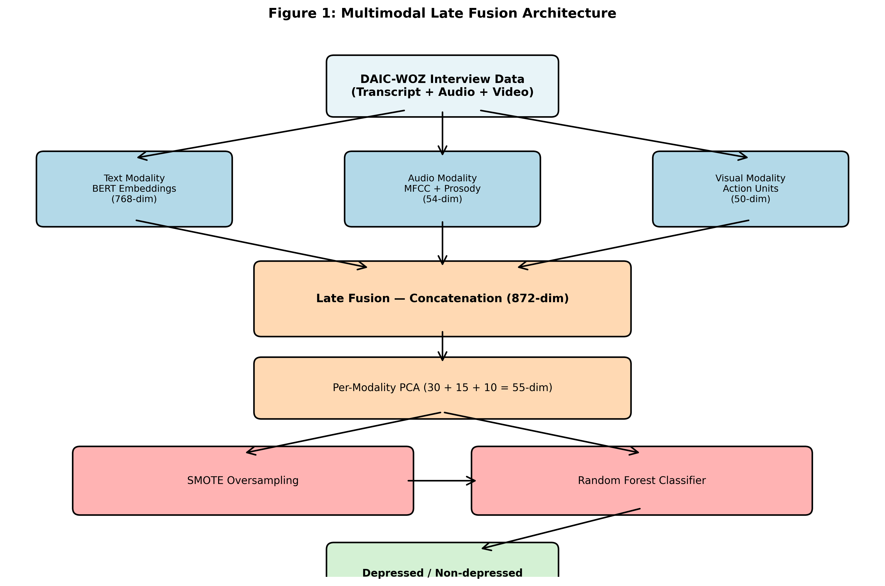
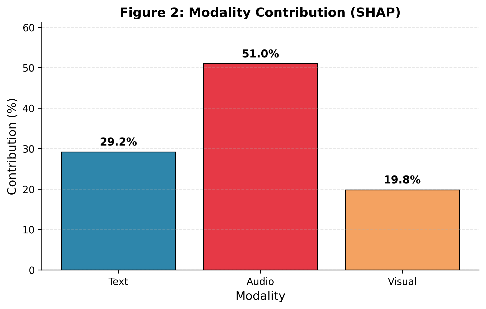
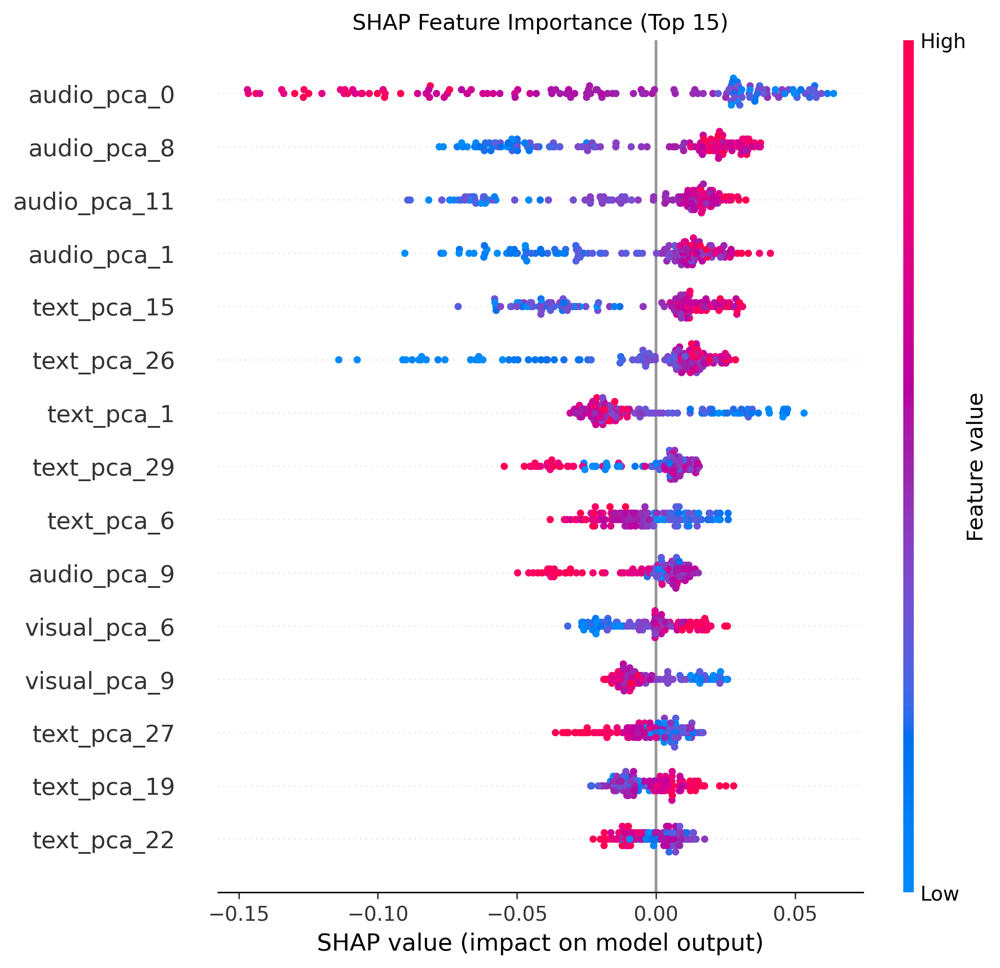
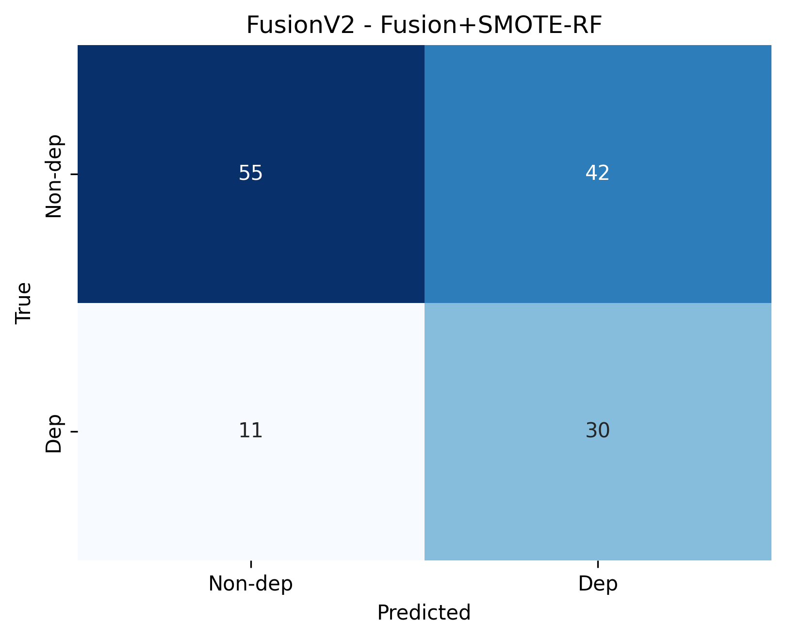

# A Multimodal Explainable AI Framework for Depression Detection

### Integrating Textual, Acoustic, and Visual Cues via Late Fusion

 

 

**Department of Computer Science and Engineering**
**Uttara University · Dhaka, Bangladesh**

 

[Overview](#overview) · [Architecture](#architecture) · [Results](#results) · [Installation](#installation) · [Usage](#usage) · [Citation](#citation)

---

## Authorship

<table align="center">
  <thead>
    <tr>
      <th align="center">Role</th>
      <th align="center">Name</th>
      <th align="center">Affiliation</th>
    </tr>
  </thead>
  <tbody>
    <tr>
      <td align="center"><b>Supervisor</b></td>
      <td align="center"><b>Md. Morshed Ali</b></td>
      <td align="center">Lecturer and Coordinator Department of CSE, Uttara University</td>
    </tr>
    <tr>
      <td align="center">Author</td>
      <td align="center">Md. Murad Hossain</td>
      <td align="center">Department of CSE, Uttara University</td>
    </tr>
    <tr>
      <td align="center">Author</td>
      <td align="center">MD. Foysal Ahammed Joy</td>
      <td align="center">Department of CSE, Uttara University</td>
    </tr>
    <tr>
      <td align="center">Author</td>
      <td align="center">Nuruzzaman Shuvo</td>
      <td align="center">Department of CSE, Uttara University</td>
    </tr>
  </tbody>
</table>

---

## Overview

This repository presents a **Late Fusion multimodal framework** for automated depression detection on the DAIC-WOZ benchmark. The framework combines three complementary modalities to capture behavioral, linguistic, and acoustic markers of depression:

| Modality | Features | Dimension |
|:--------:|:---------|:---------:|
| **Textual** | BERT contextual embeddings from participant utterances | 768 |
| **Acoustic** | MFCC, Chroma, Pitch, Energy, Zero-Crossing Rate | 54 |
| **Visual** | Action Units, Head Pose, Eye Gaze (OpenFace) | 50 |
| **Fused** | Concatenation (Late Fusion) | **872** |

To address the "black-box" limitation of clinical AI systems, the framework integrates **SHAP (SHapley Additive exPlanations)** at both global and patient levels.

---

## Key Results

### 5-Fold Stratified Cross-Validation Performance

| Metric | Score |
|:------:|:-----:|
| **F1-Score** | **0.569** |
| **ROC-AUC** | **0.697** |
| **Accuracy** | **0.681** |
| Precision | 0.475 |
| Recall | 0.707 |

### Modality Contribution (SHAP)

| Modality | Contribution |
|:--------:|:------------:|
| **Audio** | **51.0%** |
| Text | 29.2% |
| Visual | 19.8% |

---

## Architecture

  

 

**Pipeline Stages:**

| Stage | Operation | Output Shape |
|:-----:|:----------|:------------:|
| **1** | Input: DAIC-WOZ interview (transcript + audio + video) | — |
| **2** | Feature Extraction: BERT (768) + Librosa (54) + OpenFace (50) | 872 |
| **3** | Late Fusion: Concatenation of modalities | 872 |
| **4** | Per-Modality PCA: Text (30) + Audio (15) + Visual (10) | 55 |
| **5** | SMOTE Oversampling (k=3) | 55 |
| **6** | Random Forest (n=200, depth=6, balanced_subsample) | — |
| **7** | Threshold Tuning (optimal = 0.40) | — |
| **8** | Output: Depressed / Non-depressed | — |

---

## Results

### Modality Contribution

  

Acoustic features contribute the most to predictions (51.0%), followed by textual (29.2%) and visual (19.8%) modalities.

### SHAP Feature Importance

  

Top 15 most impactful features across all three modalities, ranked by mean absolute SHAP value.

### Confusion Matrix

  

Confusion matrix from the Late Fusion model with tuned threshold (0.40).

---

## Repository Structure
